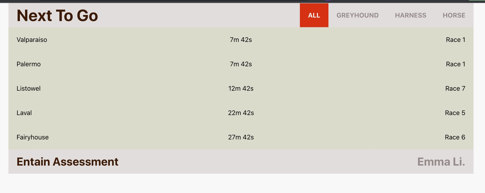

# Entain Assessment

This project was bootstrapped with [Create React App](https://github.com/facebook/create-react-app), using the [Redux](https://redux.js.org/) and [Redux Toolkit](https://redux-toolkit.js.org/) TS template.

## 1. Task & Requirement

- Create a single page application that displays 'Next to go’ races using our API.
- A user should see 5 races at all times, and they should be sorted by time ascending. Race should disappear from the list after 1 min past the start time (​advertised_start).
- User should see meeting name (​meeting_name), race number (​race_number) and countdown timer that indicates the start of the race.
- User should be able to toggle race categories to view races belonging to only the selected category.

## 2. Start App

### 2.1 Start apps locally

```
$ npm start
```

This will start development servers for:

- React SPA - [http://localhost:3000](http://localhost:3000)

### 2.2 npm test

```
$ npm test
```

Launches the test runner in the interactive watch mode.\
See the section about [running tests](https://facebook.github.io/create-react-app/docs/running-tests) for more information.

## 3. Browse the app

Visit [http://localhost:3000](http://localhost:3000) in your browser. You should see a homepage similar to:



## 4. App Skills & Structure

### tech skills

TypeScript, React, Redux, SASS, Jest, Axios, Eslint

### modules

```shell


             ┌── api
             ├     ├── index  request methods to fetch data from APIs
             ├     ├── path
             ├     └── request  custom packaged function with axios by adding interceptors
             ├
      src ── ├── views
             ├     └── Main
             ├
             ├── components
             ├        ├── Header
             ├        ├── Footer
             ├        ├── Container
             ├        ├── Loading
             ├        ├── RaceItem
             ├        ├── RaceList
             ├        └── index      collect all the above components
             ├
             ├── store
             ├      ├── hooks
             ├      ├── store
             ├      └── features
             ├            └── categorySlice
             ├
             ├── styles
             ├      ├── _type
             ├      ├── _variables
             ├      └── global
             ├
             ├── interfaces
             ├      ├── categories
             ├      └── nextRaces
             ├
             └── utils
                    ├── getCategoryId
                    ├── getCountDown
                    ├── getCountDown.test
                    └── getTimeRemaining


```

### on live (AWS)

https://entain-assessment-emmali.s3.ap-southeast-2.amazonaws.com/index.html

### video (locally)

https://entain-assessment-emmali.s3.ap-southeast-2.amazonaws.com/video.mp4
